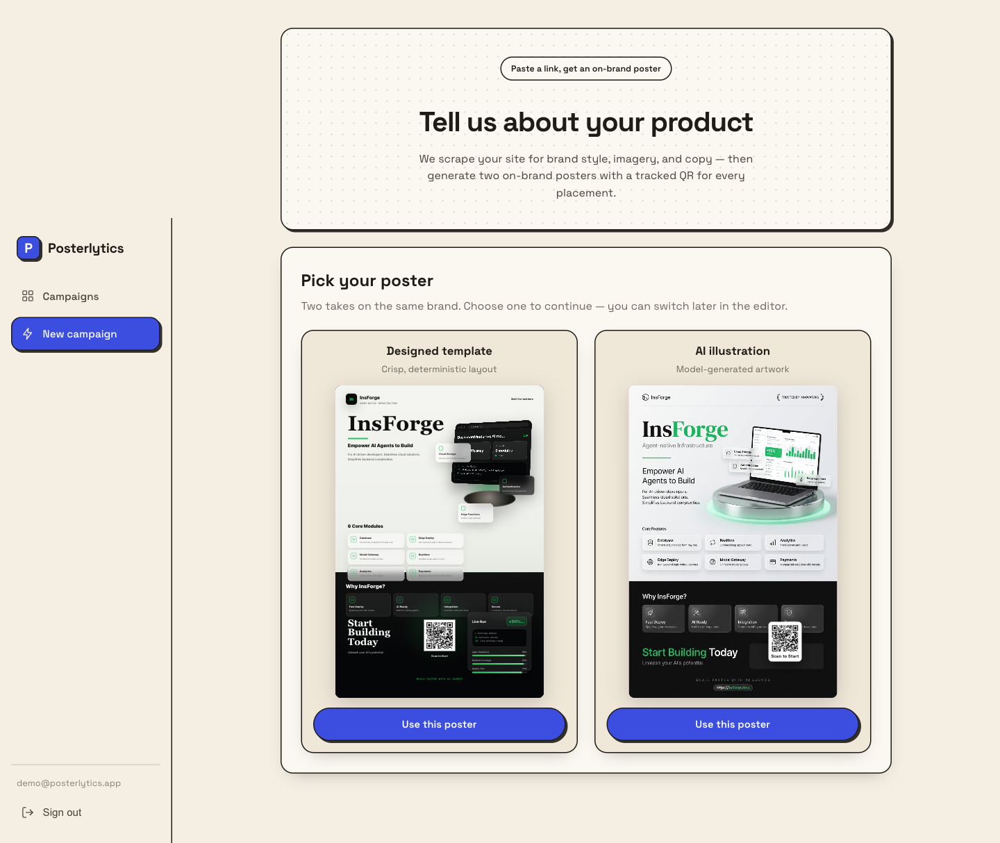
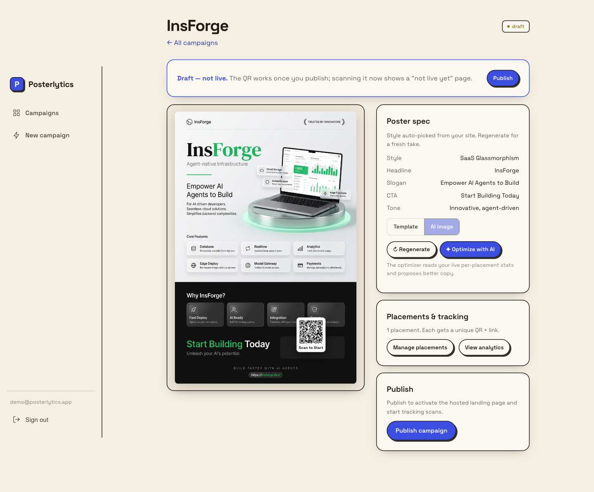
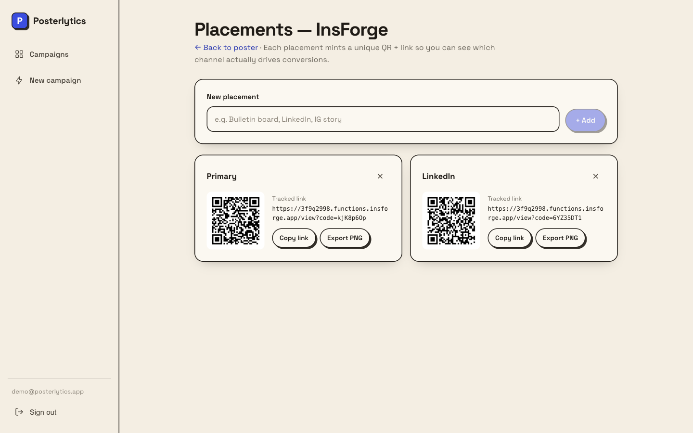
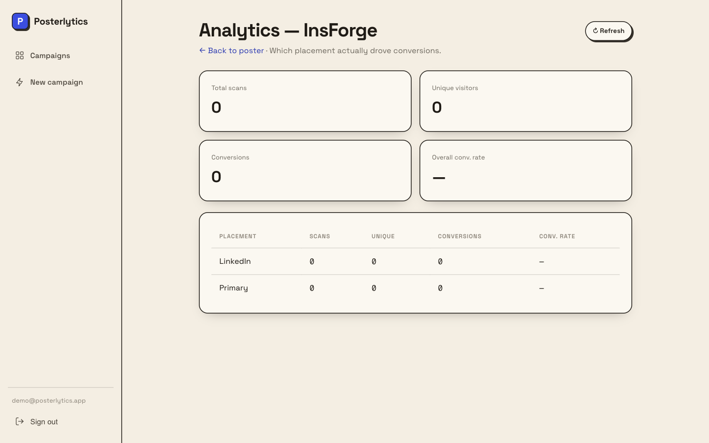

# Posterlytics

Turn a product's own website into an on-brand **advertising poster**, mint a
**unique tracked QR/link per placement** (bulletin board, LinkedIn, IG story…),
and see **which placement actually drove conversions — not just clicks**.

Per-placement attribution is the moat: same product, N unique codes, every scan
and conversion logged, so the dashboard answers "the bulletin board out-pulled
LinkedIn" — which a generic shortener can't.

> Live: **https://3f9q2998.insforge.site**

## Pick your poster

Paste a URL and Posterlytics generates **two on-brand posters** from the same
analysis — a crisp **deterministic HTML/CSS template** and an **AI illustration**
— then you choose. Both carry a real, always-scannable QR.



## Editor

The chosen poster, the auto-extracted spec (style, headline, slogan, CTA, tone),
a Template ↔ AI-image toggle, and one-click publish.



## Per-placement tracking

Every placement mints its own short code → unique QR + tracked link, so you can
tell which channel converts.



## Attribution dashboard

Scans, unique visitors, conversions, and conversion rate — per placement.



## How it works

1. **Sign in** (email + password, no verification).
2. **New campaign** — paste your product URL + GTM details (name, tagline, CTA,
   destination).
3. **Poster Agent** (`analyze` function) scrapes the site, mines the brand's
   **real palette** from its CSS, pulls assets (logo, og:image → re-hosted in
   Storage), and uses gpt-4o to produce:
   - `poster_content` — structured product copy (features, how-it-works,
     why-use-it) used to enrich the poster text
   - `style_profile` — the brand's palette / fonts / tone
   - `brand_essence` — a word-portrait of the brand for the image model
4. **Designed + painted** — the `designer` agent designs a bespoke
   `poster_layout` from that context, then the `hero` function paints it as an
   illustrated 2:3 poster; the real per-placement QR is composited into a
   branded bottom band (`AiPoster`). Exportable to PNG per placement
   (`html-to-image`).
5. **Placements** — each mints a unique short code → unique QR/link.
6. **Publish** — activates the tracked QR links.
7. **Scan** → `view` logs the scan (device from UA, first-party visitor cookie)
   **and** the conversion in one step, then 302s straight to the real product
   page. A scan *is* the conversion — there's no intermediate landing page.
8. **Dashboard** — per-placement scans / unique visitors / conversions / rate.

## Architecture

- **Frontend**: Vite + React + TypeScript SPA (`src/`). Auth-gated dashboard.
- **Backend**: InsForge (Postgres + RLS, Storage, Auth, edge functions).
- **Edge functions** (`functions/`, Deno): `view` (the tracked QR redirect),
  `analyze`, `designer`, `hero`. Source imports `_shared.ts`; `functions/build.mjs`
  inlines it into one deployable file per function (Subhosting uploads a single file).
- **AI**: InsForge AI proxy (`/api/ai/chat/completion`, `/api/ai/image/generation`)
  with the project key — no separate OpenRouter key needed.
- **Schema**: `db/*.sql` applied via `npx @insforge/cli db import`. Owner-only
  dashboard access; anon can read only published campaigns and write (not read)
  scans/conversions; uniqueness + stats via `SECURITY DEFINER` RPCs.

## Develop

```bash
npm install
npm run dev          # http://localhost:5173  (.env.local has VITE_INSFORGE_URL / _ANON_KEY)
npm run build        # type-check + bundle
```

### Edge functions

```bash
node functions/build.mjs                 # build all → functions/dist/<slug>.ts
npx @insforge/cli functions deploy view --file ./functions/dist/view.ts
# repeat for analyze, designer, hero
```

### Database

```bash
npx @insforge/cli db import db/01_campaigns.sql   # apply all db/*.sql in numeric order
npx @insforge/cli db tables && npx @insforge/cli db policies
```

## Deploy

```bash
npm run build
npx @insforge/cli deployments env set VITE_INSFORGE_URL https://3f9q2998.us-east.insforge.app
npx @insforge/cli deployments env set VITE_INSFORGE_ANON_KEY <anon-key>
npx @insforge/cli deployments deploy .
```
